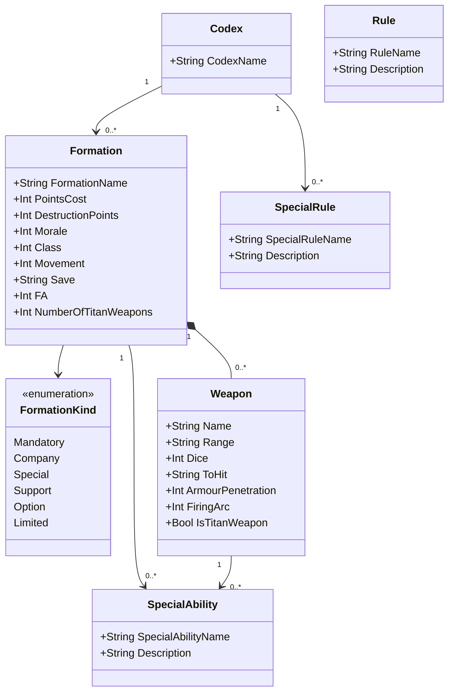

```mermaid
classDiagram

    class Codex {
        +String CodexName
    }

    class Formation {
        +String FormationName
        +Int PointsCost
        +Int DestructionPoints
        +Int Morale
        +Int Class
        +Int Movement
        +String Save
        +Int FA
        +Int NumberOfTitanWeapons
    }

    class FormationKind {
        <<enumeration>>
        Mandatory
        Company
        Special
        Support
        Option
        Limited
    }

    class SpecialRule {
        +String SpecialRuleName
        +String Description
    }

    class Weapon {
        +String Name
        +String Range
        +Int Dice
        +String ToHit
        +Int ArmourPenetration
        +Int FiringArc
        +Bool IsTitanWeapon
    }

    class SpecialAbility {
        +String SpecialAbilityName
        +String Description
    }

    class Rule {
        +String RuleName
        +String Description
    }

    Codex "1" --> "0..*" Formation
    Formation --> FormationKind
    Formation "1" *-- "0..*" Weapon
    Formation "1" --> "0..*" SpecialAbility
    Weapon "1" --> "0..*" SpecialAbility
    Codex "1" --> "0..*" SpecialRule
```

